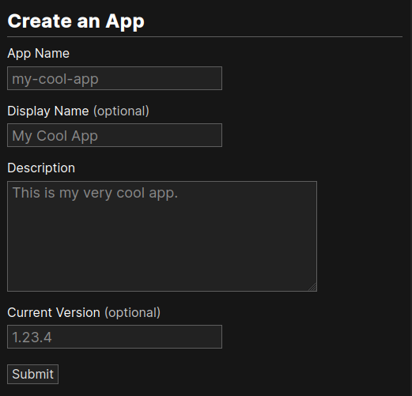
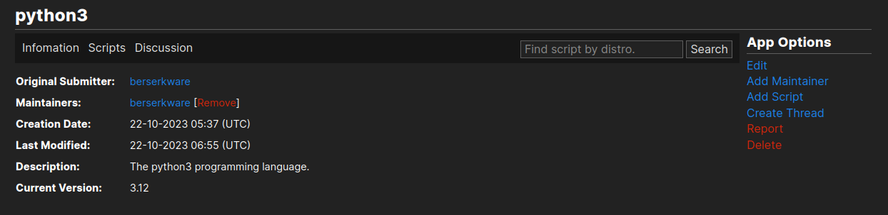

Creating and Managing Apps
==========================

Apps are used to organize scripts that are for installing that app. This is a guide on how
to create and manage apps.

Creating Apps
-------------

The app name cannot contain capitals or spaces. You can stylise the name with the
display name field. You can describe the app with the description.

When you create an app, there are four input fields. The "Current Version" field
is the only one that might not be self-explanatory. You can put the the current
version of the app. This gets passed into the scripts if the
user doesn't specify a version to install.

Managing Apps
-------------

Maintainers
***********

To manage apps you must be a maintainer. You can add a maintainer by clicking the link on
the app sidebar. You have to remember that maintainers you add will have the exact same
permissions as you, so don't add just anyone. The app submitter doesn't have any permission
to edit the app, unless they are a maintainer.

You can remove maintainers by clicking remove next to their name in the maintainer list.

Editing
*******

You can edit apps by clicking the "Edit" link in the app sidebar. The only thing you cannot
edit is the app name.

Deleting
********

You cannot delete apps, as many people might have worked on scripts attached to the app. 
