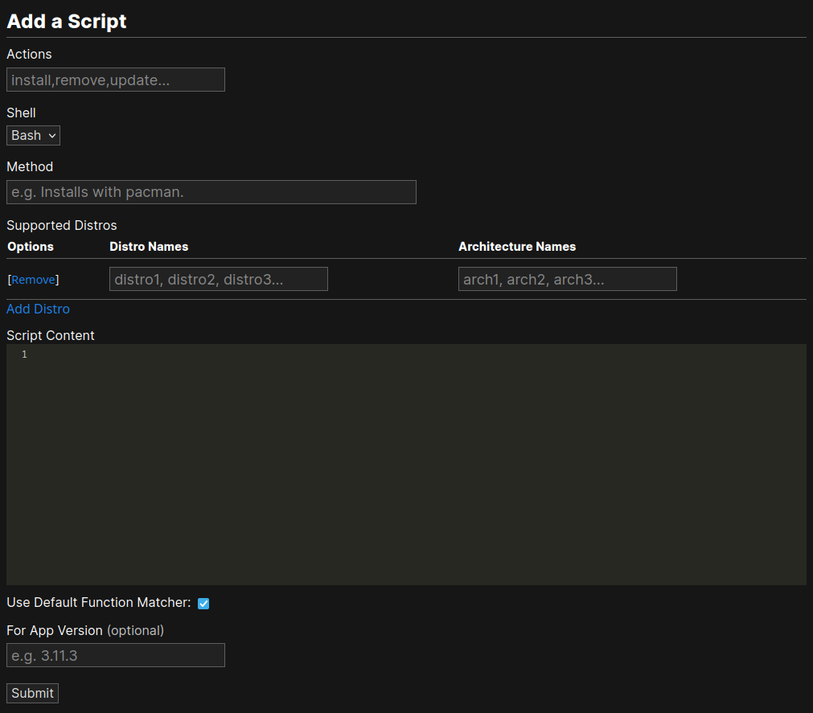

Creating and Managing Scripts
=============================

Scripts are how Installies installs, removes, updates, or compiles apps. This is a guide on how
to create and manage scripts.

Creating Scripts
----------------

You can create a script by clicking the "Add Script" link on the app sidebar. This will
take you to the add script form. The "Actions" input should contain a comma separated list of
actions the script supports. The "Method" input should contain a short sentence on how
the script works.

Supported Distros
*****************

In each row in the supported distros table, you can add the distros and the architechture that
this script supports. Adding another row allows you to add distros that support different distros.
You can remove a row of distros by clicking the remove button on the left of the row.

Content
*******

The code for each action should be inclosed in it's own bash function. You can add code that
will run for any action by putting it outside the functions.

.. code-block:: bash

   # put code that will run for any action here

   function install {
	# put install code here
   }

   function remove {
	# put remove code here
   }

   function update {
	# put update code here
   }

An if block is added to the end of the script when you download it to match the first arg to a
function. Here is an example of the if block code.

.. code-block:: bash

   if [ "$1" == "install" ]; then
	install
   fi
   if [ "$1" == "remove" ]; then
	remove
   fi
   if [ "$1" == "update" ]; then
	update
   fi

For App Version
***************

This is an optional input for specifying a version of the app that the script installs.

Managing Scripts
----------------

Maintainers
***********

To manage scripts you must be a maintainer. You can add a maintainer by clicking the link in
the script options. You have to remember that maintainers you add will have the exact same
permissions as you, so don't add just anyone. The script submitter doesn't have any permission
to edit the script, unless they are a maintainer.

You can remove maintainers by clicking remove next to their name in the maintainer list.

Editing
*******

You can edit scripts by clicking the edit link in the script options.

Deleting
********

You can delete scripts by clicking the delete link in the script options.
