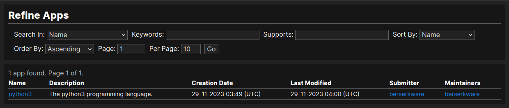
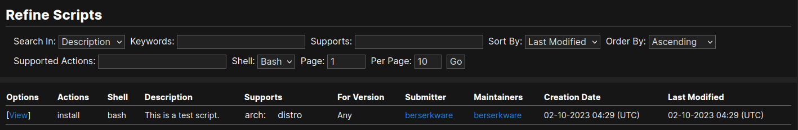

How to use Installies
=====================

Apps
----

Apps are used to organized scripts that are for installing that app.

Finding Apps
************

You can see the recently updated and newest apps on the homepage, but if you want to
find a specific app, you will need to search. You can quickly search by name with the
search bar, or you can go directly to the `apps page <https://installies.org/apps>`_
for more search options.

All the search options are pretty easy to understand, except for the "Supports" option.
You can use the Supports option to only show apps that support the distros given. The
distros must be separated by commas. You can specify a architechture with ``:arch_name``.
You can substitute the distro name with ``*`` to match any distros.

Scripts
-------

Scripts are how Installies installs, removes, updates, or compiles apps.

Finding Scripts
***************

You can find scripts under the Scripts tab on the app info page. Like the app search options,
most of the search options for scripts are pretty straight foward to understand. The only two
options that might not be simple are the "Supports" and "Supported Action" search options. The
"Supports" option is the same as the app version. The "Supported Actions" option is where you
can specify the actions that the script supports. It is a comman separated list.

Downloading and Running Scripts
*******************************

You can download scripts on the script info page. You can specify the version to install.
It is not guaranteed that the script actually installs the version you specified, so if
you want to confirm you can check the script code.

You can run the script by making the bash script exectutable then executing the script with
the first argument being the desired action.

.. code-block::

   $ chmod +x ./script_name.sh
   $ ./script_name.sh action_name

